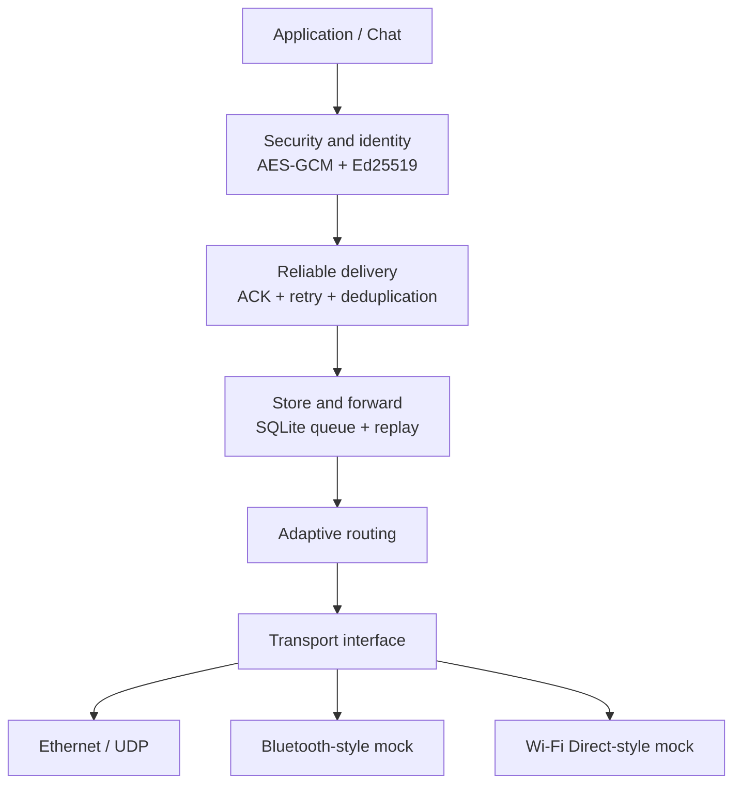

# DisasterConnect — Resilient Heterogeneous P2P Mesh Network

DisasterConnect is a Python networking project that explores reliable and secure message delivery when direct paths fail. It combines adaptive multi-hop routing, ACK/retry delivery, SQLite-backed store-and-forward, and end-to-end payload protection behind a transport-agnostic routing layer.

The interactive chat application remains available through `main.py`. The resilience and security components are independently testable and benchmarked using deterministic in-memory transports.

## Architecture



An intermediate node forwards encrypted envelopes without needing plaintext. At the destination, the envelope is authenticated, decrypted, acknowledged, and delivered once to the application.

## Capabilities

- Versioned protocol envelopes with TTL and duplicate suppression.
- Adaptive multi-hop routing across homogeneous or simulated mixed links.
- Reliable delivery with ACK correlation and bounded retries.
- SQLite-backed store-and-forward with route recovery and replay.
- AES-256-GCM payload confidentiality and integrity.
- Ed25519 sender signatures, trusted-peer verification, and replay detection.
- Deterministic benchmarks for transport dispatch and security cost.

## Setup

Requirements: Python 3.12+ is recommended.

```powershell
python -m pip install -r requirements.txt
python -m pytest -q
```

Run the local chat application:

```powershell
python main.py
```

Optional React frontend:

```powershell
cd frontend
npm install
npm start
```

## Reproduce the measurements

```powershell
python -m benchmarks.benchmark_transports
python -m benchmarks.benchmark_security
python -m benchmarks.benchmark_store_forward
python -m benchmarks.benchmark_recovery
```

The following Phase 9–10 results were recorded on a deterministic in-memory mock network. They measure implementation overhead, **not** real Ethernet, Bluetooth, or Wi-Fi Direct latency.

| Metric | Result |
| --- | ---: |
| 1-hop Ethernet p50 | 0.042 ms |
| 4-hop homogeneous p50 | 0.028 ms |
| 4-hop heterogeneous p50 | 0.025 ms |
| Simulated transport delivery rate | 100% |
| AES-GCM encrypt, 4 KB p50 | 0.016 ms |
| AES-GCM decrypt, 4 KB p50 | 0.011 ms |
| Ed25519 sign, 4 KB p50 | 0.100 ms |
| Ed25519 verify, 4 KB p50 | 0.170 ms |
| Plaintext reliable delivery, 4 KB p50 | 0.031 ms |
| Encrypted reliable delivery, 4 KB p50 | 0.544 ms |
| Regression tests | 81 passed |

At microsecond scale, small run-to-run differences are noise; the defensible transport result is that mixed-link simulation maintained 100% delivery with no material median dispatch penalty. See [Phase 9–10 notes](docs/phase_9_10.md) for benchmark scope and security design constraints.

## Failure and recovery flow

```text
route unavailable → persist encrypted envelope → route recovers
→ replay same message_id → authenticate and decrypt → ACK
→ duplicate suppression → exactly-once application delivery
```

## Project layout

```text
p2p/          Protocol, routing, transports, reliability, persistence, security
tests/        Unit and integration coverage
benchmarks/   Reproducible performance scripts
docs/         Architecture, roadmap, and measurement notes
main.py       Local chat / Flask entry point
```

## Security and measurement scope

Keys are provisioned out of band for this project; it does not implement a PKI or key-exchange protocol. Do not commit keys or expose the demo service to an untrusted network without production-grade authentication, authorization, key management, rate limiting, and operational hardening.
