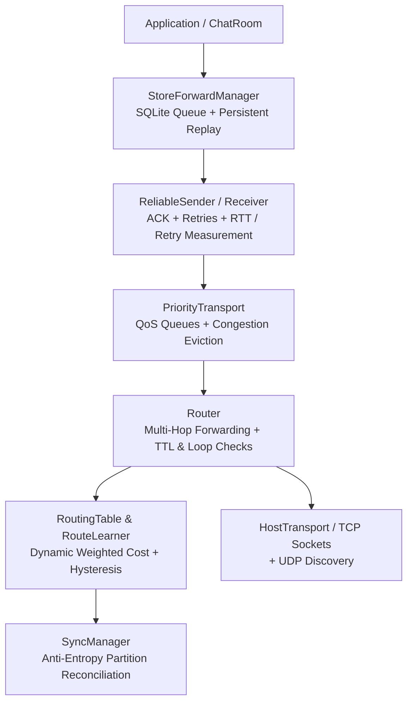

# DisasterConnect — Resilient P2P Mesh Network

DisasterConnect is a Python networking project designed for resilient communication in disconnected and infrastructure-constrained environments. It combines real-TCP multi-hop forwarding, dynamic weighted distance-vector routing, anti-entropy partition synchronization, QoS priority queuing with congestion control, SQLite persistent store-and-forward, and end-to-end payload protection behind a layered peer-to-peer architecture.

The interactive local chat application runs via `main.py` (with an optional React web UI), backed by a production-ready TCP host transport and UDP peer discovery.

---

## Architecture



### Supporting Subsystems
- **PeerManager:** Discovers and tracks direct neighbors, listening ports, and status transitions.
- **SyncManager:** Automatically reconciles missing message histories when partitioned network segments reconnect.
- **SecurityContext (`p2p/security.py`):** AES-256-GCM authenticated payload encryption and Ed25519 digital signatures.
- **Structured Logging (`p2p/log.py`):** Machine-readable JSON logs configurable via `DC_LOG_LEVEL`.

---

## Core Capabilities

- **Real-TCP Multi-Hop Forwarding:** Nodes dynamically discover and forward packets across intermediate hops without requiring direct physical socket connections between source and ultimate destination.
- **Dynamic Weighted Routing:** Route selection is driven by measured real-time link quality rather than naive hop counts:
  $$\text{link\_cost} = 100 + \text{RTT\_penalty} + \text{retry\_penalty} + \text{congestion\_penalty}$$
  - $\text{RTT\_penalty} = \text{int}(\text{RTT}_{\text{EMA}} / 10)$
  - $\text{retry\_penalty} = \text{int}(150 \times \text{retry\_rate})$
  - $\text{congestion\_penalty} = \text{int}(100 \times \text{queue\_pressure})$
- **Anti-Flapping Route Hysteresis:** An alternate route only supersedes an active route if the cost improvement exceeds $\max(25, 0.15 \times C_{\text{curr}})$, preventing route bouncing under minor jitter.
- **Partition Synchronization:** Anti-entropy delta exchange (`sync_request` / `sync_response`) reconciles missing messages across healed partitions without duplicate deliveries.
- **QoS Priority Queuing & Congestion Control:** Multi-tier priority scheduling prioritizes emergency/SOS messages and drops low-priority traffic under queue pressure.
- **Store-and-Forward Resilience:** Messages destined for unreachable peers are safely stored in SQLite and automatically replayed upon route recovery.
- **Separation of Routing & Forwarding Concerns:** `RouteEntry.metric` (dynamic integer cost) is decoupled from `RouteEntry.hops` (physical hop count) and envelope `ttl` (forwarding limit).

---

## Transport Implementation & Hardware Scope

> [!IMPORTANT]
> **Real Production Transport:** DisasterConnect uses real **TCP sockets** (`HostTransport` / `P2PHost`) for peer-to-peer data transport and **UDP broadcast** (`p2p/discovery.py`) for local LAN peer discovery.
>
> **Simulation Transports:** Classes named `MockBluetoothTransport` and `MockWiFiDirectTransport` in `p2p/testing.py` are in-memory **simulation mocks** used strictly for deterministic multi-hop testing. The repository does **not** implement native OS Bluetooth or Wi-Fi Direct radio drivers.

---

## Setup & Execution

### Prerequisites
- Python 3.12+
- Node.js (optional, for React frontend)

### Installation
```powershell
python -m pip install -r requirements.txt
```

### Run the Chat Node
```powershell
python main.py
```
*Prompts for room name and nickname, allocates dynamic ports with race-free socket reservations, and starts the CLI chat interface and local HTTP API.*

### Optional React Frontend
```powershell
cd frontend
npm install
npm start
```

### Logging Configuration
Set the `DC_LOG_LEVEL` environment variable to configure structured JSON logging output:
```powershell
$env:DC_LOG_LEVEL="INFO"    # Windows PowerShell
python main.py
```
*Supported levels: `DEBUG`, `INFO`, `WARNING`, `ERROR`.*

---

## Verification & Testing

### Automated Regression Suite
Run the full test suite:
```powershell
python -m pytest -q
```
*Current test suite baseline: **69 passed, 1 xpassed**.*

### Core Integration Suites
```powershell
# Dynamic weighted routing & real-TCP failover
python -m pytest tests/test_dynamic_weighted_routing.py -v

# Real-TCP multi-hop forwarding & route learning
python -m pytest tests/test_multihop_integration.py -v

# Partition healing & anti-entropy synchronization
python -m pytest tests/test_partition_sync.py -v

# QoS priority queuing & congestion control
python -m pytest tests/test_priority_congestion.py -v
```

### Verification Scope
- **Automated Verification:** 14 unit and integration test suites covering all functional layers.
- **Live Real-TCP Verification:** Diamond topology ($A-B-D$ vs $A-C-D$) running 4 real TCP nodes with live latency degradation, failover, and reconvergence.
- **Simulation Verification:** Deterministic mock networks validating edge cases and security benchmarks.
- **Continuous Integration:** GitHub Actions workflow configured in `.github/workflows/ci.yml`.

---

## Project Structure

```text
p2p/
├── host.py                  # TCP P2P host & connection management
├── transport.py             # HostTransport TCP adapter interface
├── qos.py                   # QoS priority queuing & congestion control
├── routing.py               # RoutingTable & dynamic route model
├── routemanager.py          # RouteLearner dynamic advertisement engine
├── router.py                # Multi-hop forwarding & loop protection
├── reliability.py           # ReliableSender/Receiver & RTT/retry measurement
├── sync.py                  # Anti-entropy partition synchronization
├── store_forward.py         # SQLite message queue storage
├── store_forward_manager.py # Route-triggered message persistence & replay
├── discovery.py             # UDP peer discovery broadcast
├── chatroom.py              # Chat application layer & deduplication
├── security.py              # AES-256-GCM encryption & Ed25519 signatures
└── log.py                   # Structured JSON logging subsystem
tests/                       # Core integration and regression test suites
benchmarks/                  # Performance and security benchmark scripts
main.py                      # Main interactive runtime & Flask HTTP API
cli_interface.py             # Terminal chat interface loop
```
