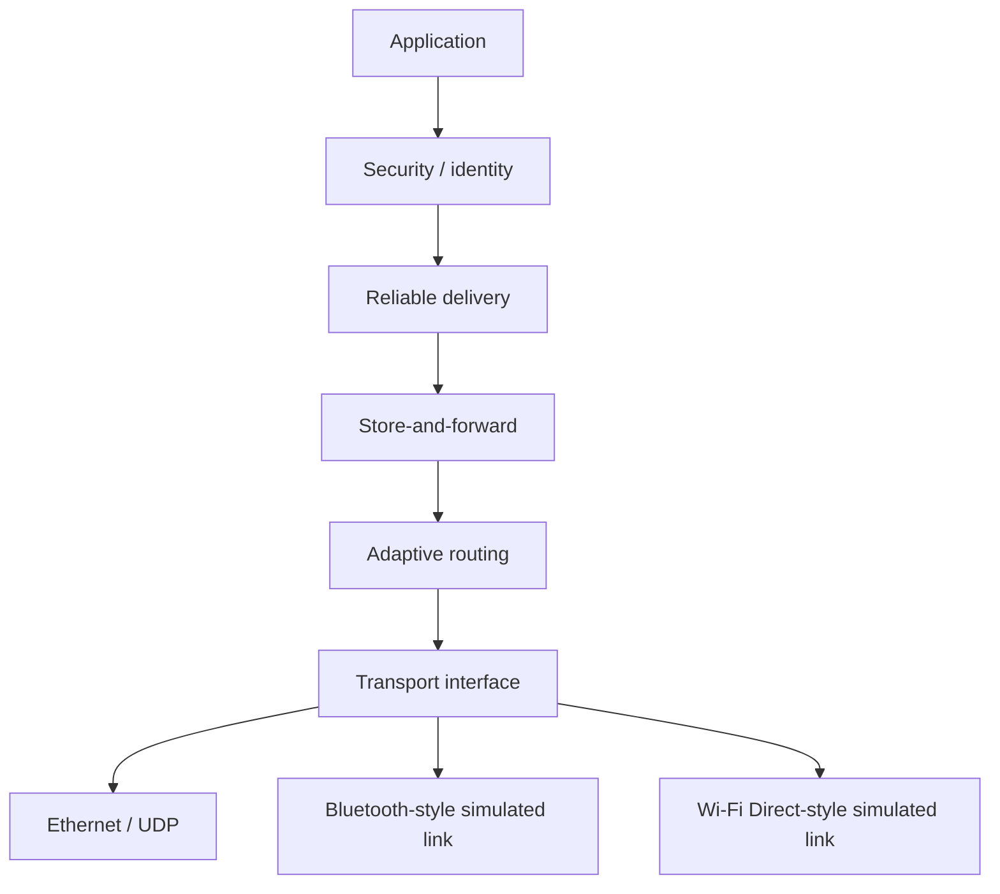

# DisasterConnect architecture

## Layer responsibilities

| Layer | Responsibility |
| --- | --- |
| Security | AES-GCM payload protection, Ed25519 signatures, trusted peers, replay detection. |
| Reliable delivery | ACK correlation, bounded retry, and exactly-once application processing. |
| Store-and-forward | Persists an already-protected envelope in SQLite until a route is available. |
| Routing | Chooses an active next hop and optional link type; decrements TTL on forwarding. |
| Transport | Presents one send/register-handler API over one or more adapters. |

## Boundary rules

- Routers do not decrypt application payloads.
- TTL and hop count are mutable routing fields and are excluded from the end-to-end signature.
- A replayed envelope is rejected by `SecurityContext`; a legitimate reliable retry is ACKed but reaches the application only once.
- The Ethernet, Bluetooth-style, and Wi-Fi Direct-style adapters used by the benchmark are deterministic mock links, not OS or hardware implementations.
