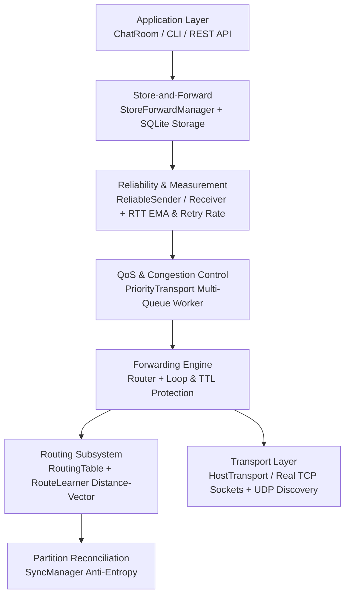

# DisasterConnect Architecture

DisasterConnect implements a modular, layered peer-to-peer networking architecture designed for resilience in dynamic and infrastructure-constrained environments.

---

## Layer Architecture & Data Flow

---

## Layer Responsibilities

| Layer | Component | Core Responsibility |
|---|---|---|
| **Application** | `ChatRoom`, `cli_interface.py` | Manages chat sessions, user identity, and deduplication of delivered messages. |
| **Store-and-Forward** | `StoreForwardManager`, `StoreForwardQueue` | Persists unacknowledged and offline messages in SQLite; replays upon route recovery. |
| **Reliability & Measurement** | `ReliableSender`, `ReliableReceiver`, `PeerLinkMetrics` | Manages ACK correlation and retries; measures live RTT EMA ($\alpha=0.2$) and 20-sample sliding-window retry rates. |
| **QoS & Congestion** | `PriorityTransport` | Enforces bounded priority scheduling (`HIGH`, `MEDIUM`, `LOW`); prioritizes emergency/SOS traffic and drops low-priority traffic under queue pressure. |
| **Forwarding Engine** | `Router` | Performs multi-hop packet forwarding, validates loop prevention rules, decrements TTL, and increments hop count. |
| **Routing Table** | `RoutingTable` | Maintains candidate routes per destination; implements dynamic metric selection with anti-flapping hysteresis. |
| **Route Learner** | `RouteLearner` | Computes dynamic link costs; periodically advertises distance-vector routing snapshots to direct neighbors. |
| **Partition Sync** | `SyncManager` | Performs bidirectional anti-entropy delta exchange (`sync_request` / `sync_response`) upon route healing. |
| **Peer Manager** | `PeerManager` | Tracks active direct neighbors, listening ports, and status transitions (`ALIVE`, `DEAD`). |
| **Transport** | `HostTransport` / `P2PHost` | Manages real TCP socket connections and local UDP discovery broadcast. |
| **Security** | `SecurityContext` (`p2p/security.py`) | Authenticated AES-256-GCM encryption and Ed25519 digital signatures. |
| **Observability** | `p2p/log.py` | Emits structured JSON logs filtered by `DC_LOG_LEVEL`. |

---

## Dynamic Weighted Routing Formula

For direct neighbor $N$:
$$\text{link\_cost}(N) = 100 + \text{RTT\_penalty} + \text{retry\_penalty} + \text{congestion\_penalty}$$

Where:
- $\text{BASE\_COST} = 100$
- $\text{RTT\_penalty} = \text{int}(\text{RTT}_{\text{EMA}} / 10)$
- $\text{retry\_penalty} = \text{int}(150 \times \text{retry\_rate})$
- $\text{congestion\_penalty} = \text{int}(100 \times \text{queue\_pressure})$

For multi-hop destination $D$ via neighbor $N$:
$$\text{new\_cost}(D \text{ via } N) = \text{advertised\_cost}(D) + \text{link\_cost}(N)$$
$$\text{new\_hops}(D \text{ via } N) = \text{advertised\_hops}(D) + 1$$

---

## Architectural Boundary Rules

1. **Decoupled Metric & Hop Tracking:** `RouteEntry.metric` represents the dynamic weighted integer cost; `RouteEntry.hops` represents physical hop count; envelope `ttl` governs hop-by-hop forwarding limits.
2. **Payload Opacity:** Intermediate forwarding routers do not decrypt or modify application payloads.
3. **Immutability of Signed Headers:** TTL and hop counts are mutable routing fields and excluded from cryptographic payload signatures.
4. **Anti-Flapping Route Hysteresis:** An alternate route only supersedes an active route if the cost improvement exceeds $\max(25, 0.15 \times C_{\text{curr}})$. Immediate fallback occurs when an active route is marked `DEAD`.
5. **Transport Scope:** Production networking uses real TCP socket connections. Bluetooth and Wi-Fi Direct implementations in `p2p/testing.py` are in-memory simulation mocks for deterministic multi-hop testing.
